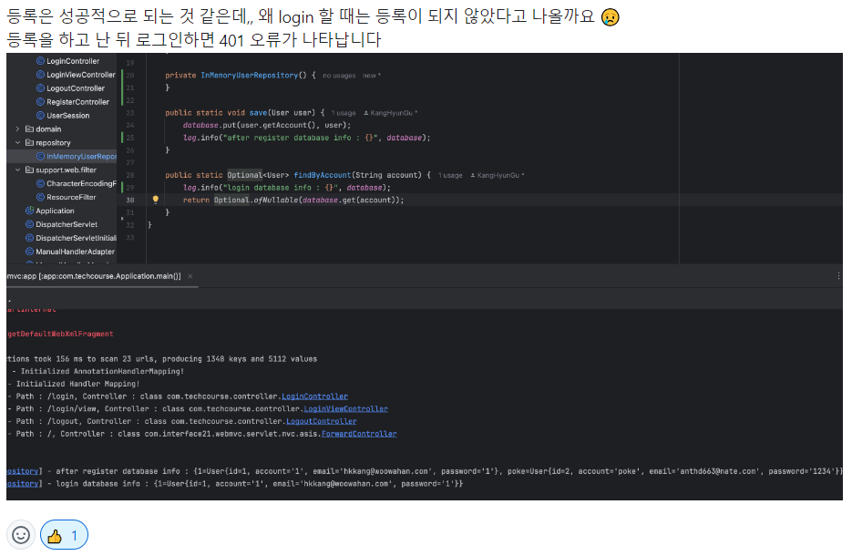
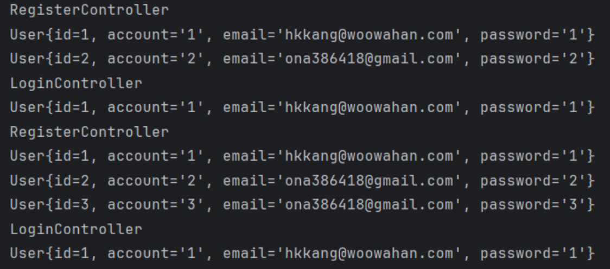

## 계기
우아한 테크 코스 레벨 4의 2번째 미션인 @MVC 구현하기를 진행하던 중이었다. 빠르게 step2를 구현하고 리뷰 요청을 보냈는데 회원가입을 했는데 해당 계정으로 로그인이 안되는 오류가 있다는 리뷰를 받았다. 

[링크](https://github.com/woowacourse/java-mvc/pull/708#discussion_r1771351206)



처음에는 단순히 코드로직에 오류가 있어서 해당 상황이 발생했다고 생각했다. 하지만 예상과는 달리 쉽게 원인을 찾을 수가 없었다.
현재 User를 관리하는 클래스인 InMemoryUserRepository는 아래와 같이 구성되어 있다.
```
public class InMemoryUserRepository {

   private static final Map<String, User> database = new ConcurrentHashMap<>();

   static {
       final var user = new User(1, "1", "1", "hkkang@woowahan.com");
       database.put(user.getAccount(), user);
   }

   public static void save(User user) {
       database.put(user.getAccount(), user);
   }

   public static Optional<User> findByAccount(String account) {
       return Optional.ofNullable(database.get(account));
   }

   private InMemoryUserRepository() {}
}
```
여기서 database를 public으로 만들어 외부에서 접근 가능하도록 한 뒤 해당 회원가입을 했을 때와 로그인을 했을 때 database에 어떤 User가 저장되어 있는지 출력하도록 했다.
```
@RequestMapping(value = "/register", method = RequestMethod.POST)
   public ModelAndView save(HttpServletRequest req, HttpServletResponse res) {
       final var user = new User(
               atomicLong.getAndIncrement(),
               req.getParameter("account"),
               req.getParameter("password"),
               req.getParameter("email")
       );
       InMemoryUserRepository.save(user);
       System.out.println("RegisterController");
       for (User u : InMemoryUserRepository.database.values()) {
           System.out.println(u);
       }

       return new ModelAndView(new JspView("redirect:/index.jsp"));
   }
```
```
@Override
   public String execute(final HttpServletRequest req, final HttpServletResponse res) throws Exception {
       if (UserSession.isLoggedIn(req.getSession())) {
           return "redirect:/index.jsp";
       }

       System.out.println("LoginController");
       for (User u : InMemoryUserRepository.database.values()) {
           System.out.println(u);
       }
       return InMemoryUserRepository.findByAccount(req.getParameter("account"))
               .map(user -> {
                   log.info("User : {}", user);
                   return login(req, user);
               })
               .orElse("redirect:/401.jsp");
   }
```
그랬더니 이상한 결과가 출력되었다.



분명 RegisterController에서 사용하는 InMemoryUserRepository에는 계속 User가 저장되고 있는데 LoginController에서 사용하는 InMemoryUserRepository에는 맨 처음에 초기화 할 때 기본 데이터로 저장한 User밖에 없었다. 즉, 서로 다른 InMemoryUserRepository를 바라보고 있어서 제대로 동작하지 않았다. 그래서 해당 이유가 발생한 원인을 찾기 위해 몇몇 크루와 함께 계속 디버깅을 하다가 InMemoryUserRepository의 static 블럭에 넣었던 디버깅용 출력문이 로그인 할 때, 회원가입 할 때 각각 출력되는 현상을 발견했다.
```
static {
    System.out.println("InMemoryUserRepository static block start");
    final var user = new User(1, "1", "1", "hkkang@woowahan.com");
    database.put(user.getAccount(), user);
}
```


왜 그런지 더 디버깅을 하다보니 RegisterController와 LoginController의 ClassLoader가 다르다는 사실을 알게 되었고, ClassLoader를 파헤치는 계기가 되었다.
```
@RequestMapping(value = "/register", method = RequestMethod.POST)
    public ModelAndView save(HttpServletRequest req, HttpServletResponse res) {
        System.out.println(this.getClass().getClassLoader().getName() + ": RegisterController ClassLoader");
        final var user = new User(
                atomicLong.getAndIncrement(),
                req.getParameter("account"),
                req.getParameter("password"),
                req.getParameter("email")
        );
        InMemoryUserRepository.save(user);

        return new ModelAndView(new JspView("redirect:/index.jsp"));
    }
```
```
@Override
    public String execute(final HttpServletRequest req, final HttpServletResponse res) throws Exception {
        System.out.println(this.getClass().getClassLoader().getName() + ": LoginController ClassLoader");
        if (UserSession.isLoggedIn(req.getSession())) {
            return "redirect:/index.jsp";
        }

        return InMemoryUserRepository.findByAccount(req.getParameter("account"))
                .map(user -> {
                    log.info("User : {}", user);
                    return login(req, user);
                })
                .orElse("redirect:/401.jsp");
    }
```


## 디버깅 과정
코드의 흐름을 먼저 설명하면 우선 Application에서 HandlerManagementManager를 초기화 해주고 있다.
```
public static void main(final String[] args) throws Exception {
       HandlerManagementManager handlerManagementManager = HandlerManagementManager.getInstance();
       handlerManagementManager.initialize(Application.class);

       final int port = defaultPortIfNull(args);
       final var tomcat = new TomcatStarter(port);
       log.info("configuring app with basedir: {}", TomcatStarter.WEBAPP_DIR_LOCATION);

       tomcat.start();
       stop(tomcat);
   }
```
HandlerManagementManager는 아래와 같이 구성되어 있다.
```
public class HandlerManagementManager {

   private static final Logger log = LoggerFactory.getLogger(HandlerManagementManager.class);
   private static final Map<String, Object> MANAGERS = new ConcurrentHashMap<>();
   private static final Set<Class<?>> HANDLER_CLASSES = HandlerManagementScanner.scanHandlerHelper(HandlerManagementManager.class, HandlerManagement.class);

   private HandlerManagementManager() {}

   private static class Singleton {
       private static final HandlerManagementManager INSTANCE = new HandlerManagementManager();
   }
   public static HandlerManagementManager getInstance() {
       return Singleton.INSTANCE;
   }

   public void initialize(Class<?> clazz) {
       registerHandlerManagement(clazz);
       registerHandlerManagement(this.getClass());
   }

   public void registerHandlerManagement(Class<?> clazz) {
       for (Class<?> handlerClass : HANDLER_CLASSES) {
           HandlerManagementScanner.scanSubTypeOf(clazz, handlerClass)
                   .forEach(this::registerHandlerManagement);
       }
   }

   private void registerHandlerManagement(Object object) {
       String clazzName = object.getClass().getName();
       if (MANAGERS.containsKey(clazzName)) {
           log.info("이미 등록되어 있는 클래스입니다");
           return;
       }
       MANAGERS.put(clazzName, object);
   }

   public <T> List<T> getHandler(Class<T> clazz) {
       return MANAGERS.values().stream()
               .filter(clazz::isInstance)
               .map(clazz::cast)
               .toList();
   }
}
```
`HandlerManagementScanner.scanHandlerHelper`에서 반환하는 값은 List.of(HandleMapping.class, HandlerAdpter.class)이다. 즉, HandlerManagementManager는 전체 패키지에서 HandlerMapping과 HandlerAdapter 구현체를 스캔하여 싱글톤으로 관리하게 만든 클래스다. HandlerManagementScanner는 Reflections를 활용해 스캔하는 역할을 맡았은 클래스다.

그 뒤 DispatcherServlet에서 HandlerMappings를 초기화 해준다.
```
public void init() {
   handlerMappings.initialize();
   handlerAdapters.initialize();
}
```
```
   public void initialize() {
       HandlerManagementManager handlerManagementManager = HandlerManagementManager.getInstance();
       List<HandlerMapping> mappings = handlerManagementManager.getHandler(HandlerMapping.class);
       mappings.forEach(handlerMapping -> handlerMapping.initialize());
       handlerMappings.addAll(mappings);
   }
```
이때 `handlerManagementManager.getHandler(HandlerMapping.class)`로 받아온 값은 ManualHandlerMapping 객체와 AnnotationHandlerMapping 객체이다. 현재 프로젝트 환경은 멀티 모듈 환경이며 ManualHandlerMapping은 app패키지에 AnnotationHandlerMapping은 mvc패키지에 위치해 있다.
그 뒤 forEach문을 통해 initialize를 호출하는데 각각의 initialize를 보면 다음과 같다.

ManualHandlerMapping의 initialize
```
public void initialize() {
   controllers.put("/", new ForwardController("/index.jsp"));
   controllers.put("/login", new LoginController());
   controllers.put("/login/view", new LoginViewController());
   controllers.put("/logout", new LogoutController());

   log.info("Initialized Handler Mapping!");
   controllers.keySet()
           .forEach(path -> log.info("Path : {}, Controller : {}", path, controllers.get(path).getClass()));
}
```
AnnotationHandlerMapping의 initialize
```
public void initialize() {
       Reflections reflections = new Reflections(ClasspathHelper.forJavaClassPath());

       Set<Class<?>> controllerClasses = reflections.getTypesAnnotatedWith(Controller.class);
       controllerClasses.stream()
               .map(clazz -> clazz.getDeclaredMethods())
               .forEach(handlerExecutions::addHandlerExecution);

       log.info("Initialized AnnotationHandlerMapping!");
   }
```
즉, ManualHandlerMapping에서는 new를 통해서 생성하고 AnnotationHandlerMapping에서는 Reflections를 통해 HandlerMapping을 생성하고 있다.
이때 문제는 `DispatcherServlet`은 `WebApplicationInitializer`의 구현체인 `DispatcherServletInitializer`에서 만들고 있고 `WebApplicationInitializer`의 구현체는 Application에서 호출하는 게 아닌 자동으로 런타임에 실행된다. 이때 DispatcherServlet의 Thread의 ContextClassLoader가 ApplicationClassLoader가 아닌 Apache Tomcat의 클래스 로더 중 하나인 ParallelWebappClassLoader설정된다는 것이다.
이것이 문제되는 이유는 new로 클래스를 만들때는 Thread의 ContextClassLoader가 영향을 미치지 않지만 Reflections를 사용할 때는 Thread의 ContextClassLoader가 영향을 미친다는 것이다.
Reflections의 생성자로 들어가보면
```
public Reflections(Object... params) {
   this(ConfigurationBuilder.build(params));
}
```
로 되어 있다. 이때 `ConfigurationBuilder.build(params)`에서 ClassLoader를 설정해준다.
```
ClassLoader[] loaders = Stream.of(params).filter(p -> p instanceof ClassLoader).distinct().toArray(ClassLoader[]::new);
if (loaders.length != 0) { builder.addClassLoaders(loaders); }
```
이때 코드에서 Reflections의 생성자에 매개변수로 패키지 위치만 넣어주었기 때문에 ClassLoader가 들어있지 않아 따로 Reflections에서 사용할 ClassLoader를 설정하지 않는다.

이제 `getTypesAnnotatedWith`의 코드를 확인해 보자.
```
public Set<Class<?>> getTypesAnnotatedWith(Class<? extends Annotation> annotation) {
   return get(SubTypes.of(TypesAnnotated.with(annotation)).asClass(loaders()));
}
```
여기서 asClass를 확인해보자.
```
default <R> QueryFunction<C, Class<?>> asClass(ClassLoader... loaders) {
   // noinspection unchecked
   return ctx -> ((Set<Class<?>>) forNames((Set) apply(ctx), Class.class, loaders));
}
```
그리고 forNames도 확인해보자.
```
default <T> Collection<T> forNames(Collection<String> names, Class<T> resultType, ClassLoader... loaders) {
   return names.stream().map(name -> forName(name, resultType, loaders)).filter(Objects::nonNull).collect(Collectors.toCollection(LinkedHashSet::new));
}
```
여기서 기억해야 할껀 resultType으로 넘어온 게 Class.class라는 사실이다. 이번엔 forName에 들어가보자.
```
default <T> T forName(String name, Class<T> resultType, ClassLoader... loaders) {
   return resultType.equals(Class.class) ? (T) forClass(name, loaders) :
      resultType.equals(Constructor.class) ? (T) forConstructor(name, loaders) :
      resultType.equals(Method.class) ? (T) forMethod(name, loaders) :
      resultType.equals(Field.class) ? (T) forField(name, loaders) :
      resultType.equals(Member.class) ? (T) forMember(name, loaders) : null;
}
```
확인해보니 resultType에 따라서 특정 함수를 실행하는 것 같다. 여기서 resultType에는 Class.class가 들어왔으니 forClass함수가 실행될 것이다.
```
default Class<?> forClass(String typeName, ClassLoader... loaders) {
   if (primitiveNames.contains(typeName)) {
      return primitiveTypes.get(primitiveNames.indexOf(typeName));
   } else {
      String type;
      if (typeName.contains("[")) {
         int i = typeName.indexOf("[");
         type = typeName.substring(0, i);
         String array = typeName.substring(i).replace("]", "");
         if (primitiveNames.contains(type)) {
            type = primitiveDescriptors.get(primitiveNames.indexOf(type));
         } else {
            type = "L" + type + ";";
         }
         type = array + type;
      } else {
         type = typeName;
      }

      for (ClassLoader classLoader : ClasspathHelper.classLoaders(loaders)) {
         if (type.contains("[")) {
            try { return Class.forName(type, false, classLoader); }
            catch (Throwable ignored) {}
         }
         try { return classLoader.loadClass(type); }
         catch (Throwable ignored) {}
      }
      return null;
   }
}
```
중요한 부분은 아래의 `ClasspathHelper.classLoaders(loaders)`를 도는 반복문이다. 여기서 ClassLoader를 통해 클래스를 로드하고 있다. 여기서 type.contains(“[“)는 타입이 배열인지 여부를 확인하는 것이다. 만약 배열이면 type에 “[“이 포함된 상태로 넘어오게 된다. 지금 HanderMapping은 배열이 아니므로 `classLoader.loadClass(type)`이 실행될 것이다. 만약 여기서 주어진 ClassLoader가 해당 클래스를 로드할 수 없으면 try-catch문에 의해 다음 ClassLoder로 넘어가게 된다. 그러면은 ClassLoder의 배열에는 어떤 ClassLoader가 넘어오게 되는지 확인해보자.
```
public static ClassLoader[] classLoaders(ClassLoader... classLoaders) {
   if (classLoaders != null && classLoaders.length != 0) {
       return classLoaders;
   } else {
       ClassLoader contextClassLoader = contextClassLoader(), staticClassLoader = staticClassLoader();
       return contextClassLoader != null ?
               staticClassLoader != null && contextClassLoader != staticClassLoader ?
                       new ClassLoader[]{contextClassLoader, staticClassLoader} :
                       new ClassLoader[]{contextClassLoader} :
               new ClassLoader[] {};
   }
}
```
이렇게 ClassLoader를 넘겨주고 있다. 여기서 매개변수에는 Reflections의 생성자에 넘겨준 ClassLoader 목록들이 넘어오게 되는데 아무것도 넘겨준 것이 없기 때문에 밑의 else문이 실행된다.
```
public static ClassLoader contextClassLoader() {
   return Thread.currentThread().getContextClassLoader();
}

public static ClassLoader staticClassLoader() {
   return Reflections.class.getClassLoader();
}
```
확인해보면 Thread의 ContextClassLoader도 고려사항에 포함되어 있다. 이때 else의 return문을 보면 contextClassLoader와 staticClassLoader가 같은지 여부를 파악하고 그에 따라 return할 값을 결정하고 있다. 이때 contextClassLoader는 ParallelWebappClassLoader이고 staticClassLoader는 ApplicationClassLoader이다.
이때 contextClassLoader가 앞에 위치해 있으므로 forClass함수에서 contextClassLoader를 통해 먼저 load를 실행해보게 된다.
그러면 ParallelWebappClassLoader가 어느 패키지에 위치해 있는 클래스를 로드할 수 있는지 확인해보자.
```
ClassLoader contextClassLoader = Thread.currentThread().getContextClassLoader();
System.out.println(contextClassLoader);
System.out.println(Arrays.toString(contextClassLoader.getDefinedPackages()));
```
위 방식을 통해 해당 ClassLoader가 로드할 수 있는 패키지들의 목록을 확인할 수 있다.


확인해보면 com.techcourse.controller에 있는 클래스들을 로드할 수 있다. 이때 RegisterController는 com.techcourse.controller에 위치해 있어 ParallelWebappClassLoader로 로드가 가능하다. 따라서 RegisterController는 ParallelWebappClassLoader에 의해 로드되고 다른 Controller들은 ApplicationClassLoader에 의해 로드된다.
각각의 ClassLoader는 자신의 클래스 공간에 클래스를 로드하고 이는 서로 다른 메모리 공간을 사용한다. 따라서 아무리 static 필드라고 하더라도 공유할 수 없다. 그렇기에 RegisterController의 InMemoryUserRepository와 LoginController의 InMemoryUserRepository가 달랐던 것이다.

그래서 HandlerManagementManager에서 Controller들을 전부 스캔해오도록 하여 ApplicationClassLoader로 로드되도록 수정하여 문제를 해결하거나 Thread.currentThread().setContextClassLoader를 통해 Thread의 ContextClassLoader를 설정하는 방법이 있는데 난 후자를 택해 문제를 해결할 수 있었다.
